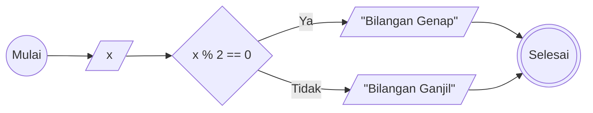
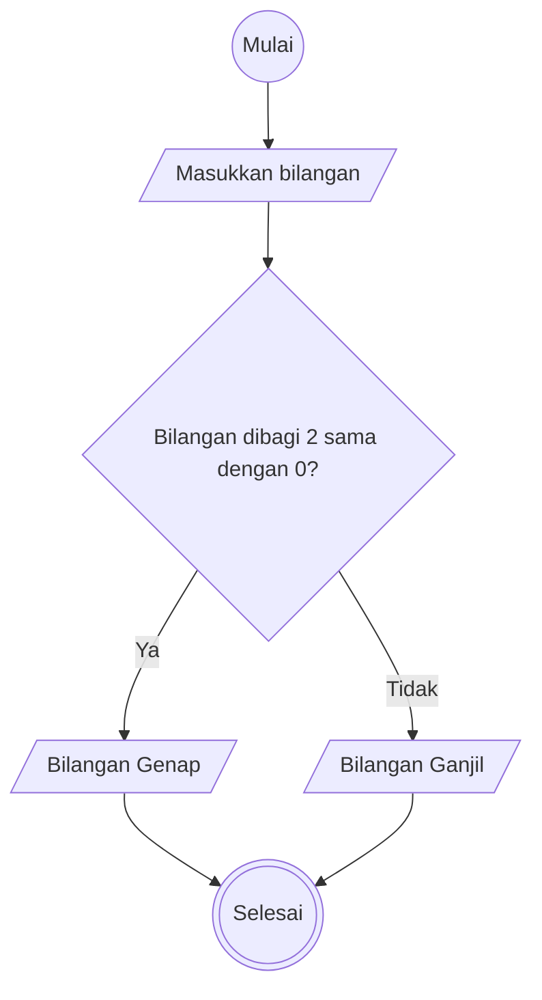

# Algoritma - Minitask 
Membuat algoritma untuk menentukan bilangan ganjil atau genap
1. Mulai
2. Masukkan bilangan yang ingin diperiksa
2. Bagi bilangan tersebut dengan 2
3. Jika tidak habis dibagi 2 atau hasilnya 1, maka bilangan tersebut bilangan ganjil
4. Jika habis dibagi 2 atau hasilnya 0, maka bilangan tersebut bilangan genap
5. Selesai

## Flowchart (Pakai sintaks semantik)


## Flowchart (Langsung shape)


## Pseudocode cara 1
```
DECLARE Ganjil: INTEGER
DECLARE Genap: INTEGER
DECLARE x: INTEGER

INPUT x

Ganjil <- x % 2 != 0
Genap <- x % 2 == 0

OUTPUT Ganjil, "adalah Bilangan Ganjil"
OUTPUT Genap, "adalah Bilangan Genap"
```

## Pseudocode cara 2
```
DECLARE Bilangan : INTEGER

INPUT Bilangan

IF Bilangan MOD 2 = 0 THEN
    OUTPUT "Bilangan Genap"
ELSE
    OUTPUT "Bilangan Ganjil"
ENDIF
```