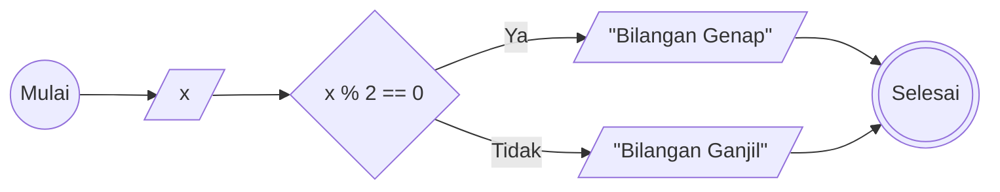
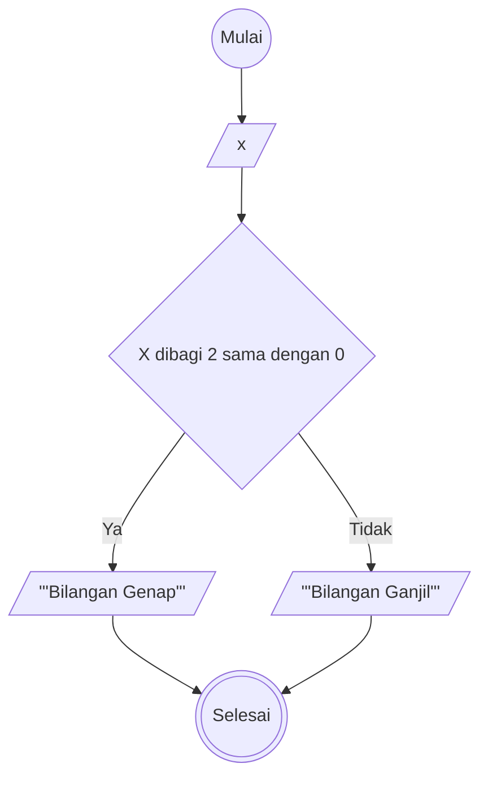

# Algoritma - Minitask 
Membuat algoritma untuk menentukan bilangan ganjil atau genap
1. Mulai
2. Masukkan bilangan x yang ingin diperiksa
3. Bagi bilangan x tersebut dengan 2
4. Jika habis dibagi 2, maka bilangan x tersebut bilangan genap
5. Jika tidak habis dibagi 2, maka bilangan x tersebut bilangan ganjil
6. Selesai

## Flowchart (Pakai sintaks semantik)


## Flowchart (Langsung shape)



## Pseudocode
```
DECLARE x: INTEGER

INPUT x

IF x MOD 2 = 0 THEN
    OUTPUT "Bilangan Genap"
ELSE
    OUTPUT "Bilangan Ganjil"
ENDIF
```