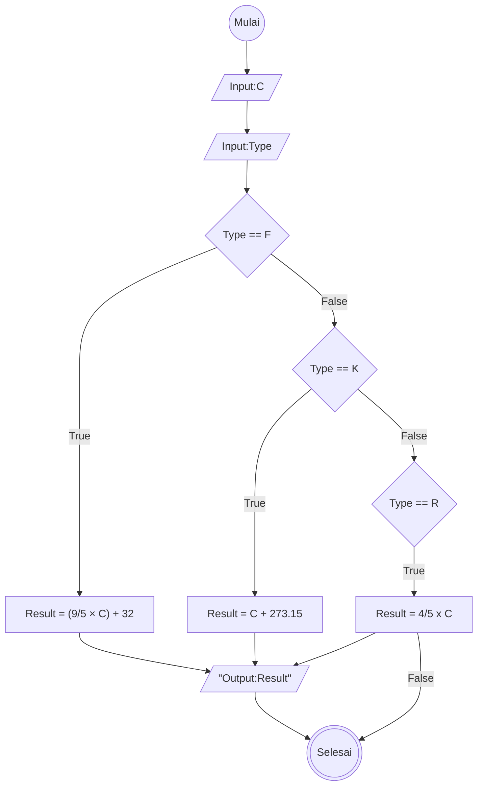

# Algoritma - Minitask 
Membuat algoritma konversi dari Celcius ke Fahrenheit, Kelvin, dan Reamur
1. Mulai
2. Tentukan variabel: C = Celcius, F = Fahrenheit, K = Kelvin, R = Reamur
3. Masukkan suhu dalam C
4. Pilih tipe konversi
5. Jika konversi ke F = (9/5 × C) + 32
6. Jika konversi ke K = C + 273.15
7. Jika konversi ke R = 4/5 x C
8. Cetak hasil F, K, atau R sebagai Result
9. Selesai

## Flowchart


## Pseudocode
```
// Program Konversi Suhu

DECLARE Celcius: REAL
DECLARE Result: REAL
DECLARE Type: CHAR

INPUT Celcius
INPUT Type

IF Type == "K"
    Result <- Celcius + 273
ENDIF
IF Type == "F"
    Result <- (9/5 x Celcius) + 32
ENDIF
IF Type == "R"
    Result <- 4/5 x Celcius
ENDIF

OUTPUT "Hasil konversi suhu adalah:", Result

