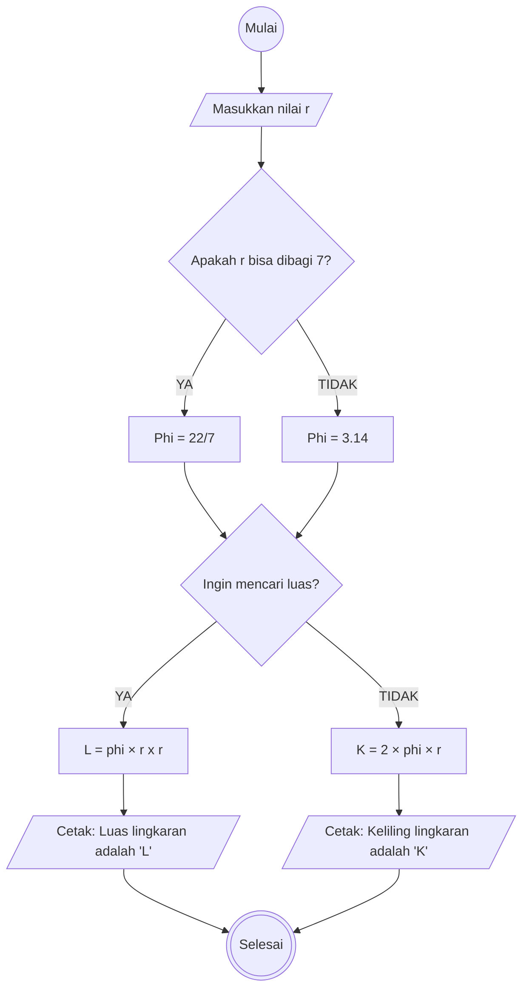

# Algoritma - Minitask 
Membuat algoritma menghitung luas dan keliling lingkaran
1. Mulai
2. Masukkan nilai r
3. Jika r bisa dibagi 7, maka nilai phi 22/7
4. Jika tidak, maka nilai phi 3.14
5. Jika ingin mencari luas lingkaran, kalikan phi dengan  r kuadrat, lalu cetak hasilnya
6. Jika tidak, kalikan angka 2 dengan phi lalu kalikan dengan r, lalu cetak hasilnya untuk mengetahui keliling lingkaran
7. Selesai

## Flowchart


## Pseudocode

```
DECLARE r: REAL
DECLARE phi: REAL
DECLARE L: REAL
DECLARE K: REAL
DECLARE pilihan: STRING

INPUT r

IF r MOD 7 = 0 THEN
    phi ← 22 / 7
ELSE
    phi ← 3.14
ENDIF

OUTPUT "Ingin mencari luas? (YA/TIDAK):"
INPUT pilihan

IF pilihan = "YA" THEN
    L ← phi * r * r
    OUTPUT "Luas lingkaran adalah ", L
ELSE
    K ← 2 * phi * r
    OUTPUT "Keliling lingkaran adalah ", K
ENDIF

```
