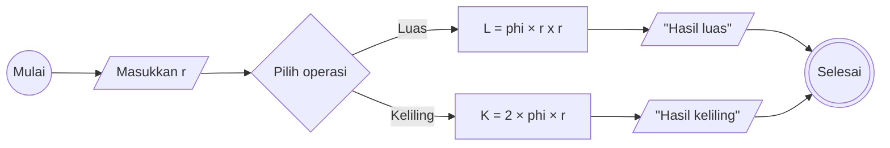

# Algoritma - Minitask 
Membuat algoritma menghitung luas dan keliling lingkaran
1. Mulai
2. Tentukan variabel: phi = 3,14, r = jari-jari, L = luas, K = keliling
3. Masukkan nilai r
4. Pilih operasi
5. Untuk mencari luas, kalikan phi dengan  r kuadrat, lalu cetak hasilnya
6. Untuk mencari keliling, kalikan angka 2 dengan phi lalu kalikan dengan r, lalu cetak hasilnya
7. Selesai

## Flowchart


## Pseudocode
```
DECLARE r: REAL
DECLARE L: REAL
DECLARE K: REAL

CONSTANT phi: 3.14

INPUT r

L <- phi x r x r
K <- 2 x phi x r

OUTPUT "Luas lingkaran adalah", L
OUTPUT "Keliling lingkaran adalah", K

